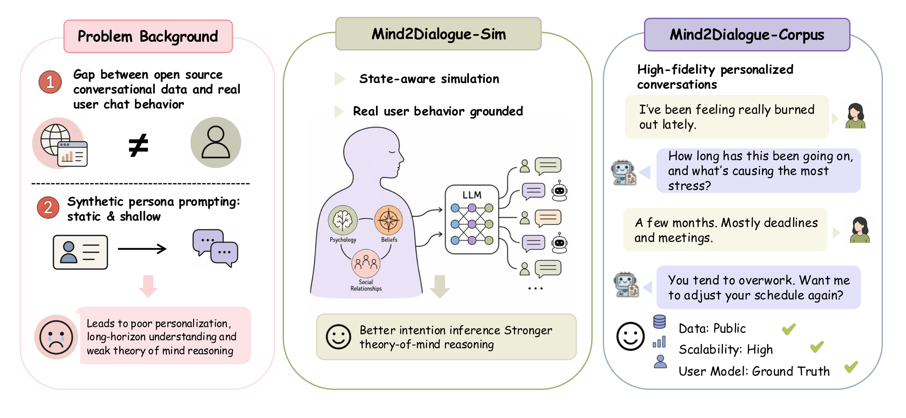

# Mind2Dialogue: Training Human-Aware Language Models by Simulating User Mental States

[](https://arxiv.org/abs/2609.15972v1)
[](https://wannabeyourfriend.github.io/mind2dialogue/)
[](https://huggingface.co/datasets/wannabeyourfriend-hf/mind2dialogue)
[](LICENSE)



Mind2Dialogue generates supervision for assistants that need to respond to users' beliefs, goals, and circumstances, including what users leave unspoken. A stateful user simulator and an Oracle assistant share an evolving, simulator-defined mental state: the state guides the user's behavior and informs the Oracle's responses. Standard supervised fine-tuning transfers these responses to a student whose dialogue input contains the persona and observable history, with the latent-state document withheld during both training and deployment.

- **M2D-Sim** combines persona-grounded scenarios, state updates, and turn-level behavior control.
- **M2D-Corpus** contains generated dialogues and question-answering examples derived from their trajectories.
- **M2D-Chat** denotes the student models trained on M2D-Corpus.

The state is a simulation control variable, not a measurement of a real person's mental state. The [paper](https://arxiv.org/abs/2609.15972v1) reports improvements on personalization across the three tested backbones; theory-of-mind transfer varies by backbone and task.

## Code and data

| Resource | Contents |
|---|---|
| [`mind2dialogue.py`](mind2dialogue.py) | Conversation generation, quality control, and QA construction |
| [`user_simulator/`](user_simulator/) | Stateful simulation, Oracle responses, behavior controller, and prompts |
| [`data/`](data/README.md) | 289 persona profiles, behavior catalog, and verified conversation seeds |
| [`training/`](training/README.md) | Paper training recipe and data requirements |
| [`evaluations/`](evaluations/README.md) | Reported benchmark protocols and available evaluation code |
| [Hugging Face](https://huggingface.co/datasets/wannabeyourfriend-hf/mind2dialogue) | 7,570 dialogues, 289 profiles, and 1,757 conversation-linked scenario seeds |

## Setup

Requirements: Python 3.10+, [uv](https://docs.astral.sh/uv/), and an OpenAI-compatible endpoint.

```bash
git clone https://github.com/wannabeyourfriend/mind2dialogue.git
cd mind2dialogue
uv sync
cp .env.example .env
```

Set your endpoint and key in `.env`. The paper uses GPT-4o-mini for data generation; the same fixed model generates user turns and Oracle responses.

```bash
OPENAI_BASE_URL=https://api.openai.com/v1
OPENAI_API_KEY=your-api-key
MODEL_NAME=gpt-4o-mini
```

## Generate data

The two commands below are alternative starting points. Begin with one persona and seed, then inspect the output before increasing the limits.

```bash
# Rewritten-query seed
uv run python mind2dialogue.py generate-conversations \
  --persona-ids profile_259 --max-prompts 1 --concurrency 1 \
  --output-dir output/example

# Scenario seed
uv run python mind2dialogue.py generate-scenarios \
  --constructor lifelong --persona-ids profile_259 --max-scenarios 1 \
  --concurrency 1 --output-dir output/scenario_example
```

The scenario families are `lifelong`, `high_frequency`, and `affective`. Use `--profiles` to select a different country file. Outputs contain conversation JSONs with state trajectories and student-view training JSONL files with the state withheld.

The four `--ablation` settings correspond to the simulator components in Table 8:

| Setting | State tracking | Behavior controller | Assistant context |
|---|---|---|---|
| `full` (default) | Yes | Yes | Persona, history, state |
| `no_behavior` | Yes | No | Persona, history, state |
| `no_state` | No | No | Persona and history |
| `oracle_profile_only` | No | Yes | Persona and history |

Score generated conversations and construct the three paper QA formats from retained tier-A items:

```bash
uv run python mind2dialogue.py check-quality \
  --conversations-dir output/example/conversations/full \
  --output-dir output/example/quality_control

uv run python mind2dialogue.py build-question-answering-data \
  --conversations-dir output/example/conversations/full \
  --quality-control-results output/example/quality_control/qc_results.jsonl \
  --output-dir output/example/qa
```

Quality control combines four programmatic checks with two model judges. QA styles are `personamem_mcq`, `prefeval_gen`, and `lamp_cls` (preference classification). Their content comes from simulated dialogues, not evaluation benchmark questions. These commands generate new examples; they do not recover the exact historical training mixture. See `--help` for each command's options.

## Development

```bash
uv sync --extra dev
uv run pytest -q
```

Tests use fake model clients. On first use, `tiktoken` may download its tokenizer vocabulary. [scripts/README.md](scripts/README.md) documents the corpus deduplication and composition-plot utilities.

## Citation and contact

```bibtex
@misc{wang2026mind2dialoguetraininghumanawarelanguage,
      title={Mind2Dialogue: Training Human-Aware Language Models by Simulating User Mental States},
      author={Zixuan Wang and Yufan Zhou and Jinzhou Tang and Xinle Yu and Chengjun Wu and Lyumanshan Ye and Zhaoxiang Feng and Letian Peng and Adyasha Patra and Fan Bai and Enze Ma and Zhengding Hu and Jianyang Gu and Zhao Wang and Yufei Ding and Jingbo Shang and Tianmin Shu and Zhiting Hu and Zhen Wang},
      year={2026},
      eprint={2609.15972},
      archivePrefix={arXiv},
      primaryClass={cs.CL},
      url={https://arxiv.org/abs/2609.15972},
}
```
