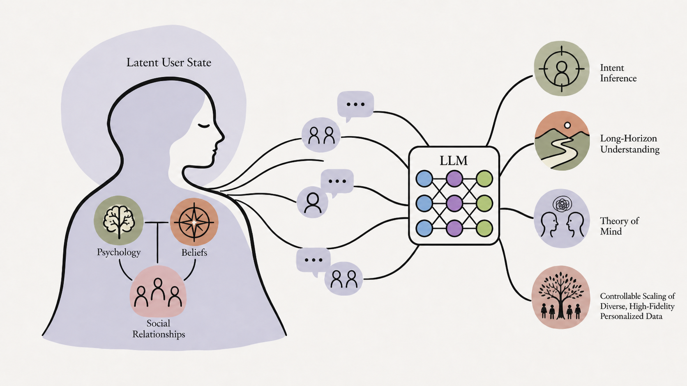
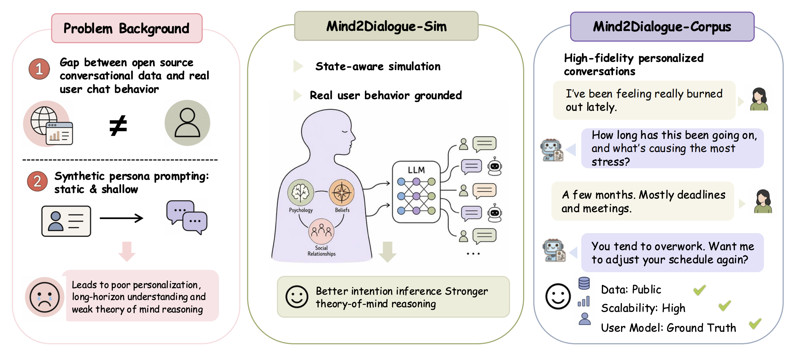

# Mind2Dialogue: State-Aware User Simulation for Theory-of-Mind and Personalization

[](https://arxiv.org/abs/xxxx)
[](https://huggingface.co/datasets/wannabeyourfriend-hf/mind2dialogue)
[](LICENSE)



## 📌 Overview

**Mind2Dialogue** is a data-generation pipeline for *state-aware* "shared-mind" simulation. Instead of role-playing a static persona, a **user simulator** carries an explicit, evolving latent state — psychological dynamics, beliefs, and shifting social relationships — and an **Oracle assistant** is granted privileged read access to that same latent state, so the two share one mind during a rollout. This privileged Oracle produces responses that are causally grounded in what the user *actually* feels and intends, and **privileged distillation** then transfers that grounding into a student model that sees only the dialogue surface. The result is synthetic conversation data with realistic causal depth rather than surface-level mimicry, yielding models with better sample efficiency and stronger intention-inference and theory-of-mind reasoning.

## 🧭 Architecture



The pipeline runs in stages: persona-grounded prompt rewriting → state-aware rollout (simulator + privileged Oracle) → quality control and A/B/C tiering → QA-format SFT construction from Tier-A conversations → optional difficulty rewriting → benchmark evaluation. Every stage is a subcommand of a single CLI (see [Quickstart](#-quickstart)).

## ⚙️ Installation

```bash
git clone --recursive https://github.com/wannabeyourfriend/mind2dialogue.git
cd mind2dialogue
uv sync   # or: pip install -e .
```

If you cloned without `--recursive`, pull the submodules with
`git submodule update --init`.

## 🔑 Environment

All stages read an OpenAI-compatible endpoint from the environment (or a local `.env`; copy `.env.example` and fill it in):

```bash
export OPENAI_BASE_URL="https://api.openai.com/v1"   # OpenAI, vLLM, or any compatible gateway
export OPENAI_API_KEY="sk-..."
export MODEL_NAME="gpt-4o-mini"                       # default model for all roles
```

Each role may be pinned to a different model. Splitting roles across models/endpoints is the recommended way to avoid self-judging bias and to pair a cheap simulator with a stronger judge:

| Variable | Role | Falls back to |
|---|---|---|
| `SIM_MODEL` | User simulator + scenario constructor | `MODEL_NAME` |
| `ORACLE_MODEL` | Privileged Oracle assistant | `MODEL_NAME` |
| `JUDGE_MODEL` | QC judges + PrefEval benchmark judge | per-command default |

## 🚀 Quickstart

Everything runs through one entry point, `python mind2dialogue.py <subcommand>`:

| Subcommand | What it does |
|---|---|
| `rollout` | Roll out state-aware conversations from rewritten persona prompts. |
| `scenario` | Construct per-persona scenarios, then roll out deep dialogues (`lifelong` / `highfreq` / `affective` / `concerning`). |
| `qc` | Quality-control scoring + A/B/C tiering of conversation JSONs. |
| `qa-build` | Build QA-format SFT data from (Tier-A) conversations. |
| `qa-rewrite` | Rewrite v1 QA items into harder, persona-grounded v2 items. |
| `qa-eval` | Benchmark models on the QA-format JSONL data. |

Run `python mind2dialogue.py <subcommand> --help` for the full flag list.

### End-to-end pipeline

```bash
# 1. Roll out conversations (full ablation = simulator + privileged Oracle)
python mind2dialogue.py rollout --ablation full --concurrency 80

# 2. (optional) Scenario-driven deep rollouts
python mind2dialogue.py scenario --constructor lifelong --concurrency 40

# 3. Quality control + A/B/C tiering
python mind2dialogue.py qc \
    --conversations-dir output/conversations/full \
    --output-dir output/qc/v1

# 4. Build QA-format SFT data from Tier-A conversations
python mind2dialogue.py qa-build \
    --conversations-dir output/conversations/full \
    --qc-results output/qc/v1/qc_results.jsonl \
    --output-dir output/qa/v1

# 5. (optional) Rewrite v1 → harder, persona-grounded v2
python mind2dialogue.py qa-rewrite \
    --qa-dir output/qa/v1 --output-dir output/qa/v2 \
    --conversations-dir output/conversations/full

# 6. Benchmark models on the QA set
python mind2dialogue.py qa-eval --qa-dir output/qa/v2 --models gpt-4o-mini gpt-5-mini
```

`rollout` writes conversation JSONs under `output/conversations/<ablation>/` and a paired SFT JSONL under `output/sft/`. `qc` writes `qc_results.jsonl` + `qc_summary.json`; `qa-eval` writes per-model predictions plus `eval_summary.{json,md}`.

## 📁 Repository layout

```
.
├── mind2dialogue.py                # single CLI: rollout · scenario · qc · qa-build · qa-rewrite · qa-eval
├── user_simulator/                 # core library
│   ├── oracle.py                   # privileged Oracle assistant
│   ├── ablation.py                 # ablation configs (full / no_privilege / no_behavior / no_state / …)
│   ├── data.py · sft.py · qa.py    # LLM client, SFT instance builder, QA generators
│   ├── prompts/                    # prompt templates (rollout, scenario, QC, rewrite)
│   ├── simulator/                  # rollout.py · user_turn.py · parsing.py · persona_block.py · behavior/
│   └── qc/                         # checks.py · judges.py (programmatic + LLM-judge QC)
├── data/                           # released artifacts (personas, prompts, behavior modes) — see data/README.md
├── training/                       # SFT trainer submodule (Unsloth + TRL)
├── evaluations/                    # personalization benchmark harness submodule
└── assets/                         # overview.png · idea-promotion.png
```

## 🧱 Submodules

- **`training/`** — one-file LoRA SFT trainer (Unsloth backbone, TRL `SFTTrainer`, response-only loss) plus per-run YAML configs and vLLM serving launchers. See [`training/README.md`](training/README.md).
- **`evaluations/`** — `multibench` harness collecting personalization / theory-of-mind benchmarks (PersonaMem, PrefEval, BigToM, LaMP). Initialize and run:

```bash
git submodule update --init evaluations
pip install -e evaluations
multibench run personamem -- \
    --api-base <server_endpoint> --model <run_name> \
    --workers 64 --output-dir results/<run_name>/PersonaMem
```

## 📦 Dataset

Released artifacts (persona library, prompt pool, persona-grounded rewrites, behavior modes) live on the Hugging Face Hub:

➡️ **https://huggingface.co/datasets/wannabeyourfriend-hf/mind2dialogue**

The release ships the inputs needed to regenerate the corpus, not the (large, expensive-to-reproduce) rollout conversations or SFT JSONLs. Run the pipeline against `data/` to produce the training corpus from scratch. Field schemas are documented in [`data/README.md`](data/README.md).

## ⚠️ Responsible use

The **concerning-scenario** generator (`simulator_concerning_scenario_constructor`, the `scenario --constructor concerning` family) produces sensitive prompts wrapped in legitimizing personas. It is intended **only** for training and benchmarking refusal-quality and safe-completion behavior, and is **withheld from the public release**. Conversations generated through it are tagged `scenario_family = "concerning"` so downstream consumers can opt out. Do not use any released data to fine-tune an assistant that lacks an upstream safety layer.

## 📖 Citation

```bibtex
@article{mind2dialogue2026,
  title  = {Mind2Dialogue: State-Aware User Simulation for Theory-of-Mind and Personalization},
  author = {Anonymous},
  year   = {2026},
}
```

## License

MIT (code) · CC-BY-4.0 (data artifacts under `data/`).
</content>
</invoke>
